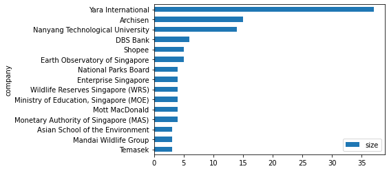

# LinkedIn Network Analysis
Date: 28 November 2021


```python
## Installing Libraries

import numpy as np
import pandas as pd
import networkx as nx
from pyvis import network as net
import janitor

import plotly.express as px
%matplotlib inline
import matplotlib.pyplot as plt
import seaborn as sns
from IPython.core.display import display, HTML

```


```python
## Loading dataset
df = pd.read_csv('data/Connections.csv',skiprows=2)
df.info() # summary info
```

    <class 'pandas.core.frame.DataFrame'>
    RangeIndex: 400 entries, 0 to 399
    Data columns (total 6 columns):
     #   Column         Non-Null Count  Dtype 
    ---  ------         --------------  ----- 
     0   First Name     397 non-null    object
     1   Last Name      397 non-null    object
     2   Email Address  7 non-null      object
     3   Company        390 non-null    object
     4   Position       390 non-null    object
     5   Connected On   400 non-null    object
    dtypes: object(6)
    memory usage: 18.9+ KB


At a quick glance, I have about 400 connections. 

## Data Cleaning

I will perform some cleaning, remove unnecessary attributes and remove null values from the data.


```python
new_df = (
        df.clean_names() # remove spacing and capitalisation
        .drop(columns=['first_name','last_name','email_address']) # dropped first, last and email
        .dropna(subset=['company','position']) # remove null values in company and position
        .to_datetime('connected_on', format='%d %b %Y') # convert date column to datetime object
)
new_df.head()
```


<div>
<style scoped>
    .dataframe tbody tr th:only-of-type {
        vertical-align: middle;
    }

    .dataframe tbody tr th {
        vertical-align: top;
    }

    .dataframe thead th {
        text-align: right;
    }
</style>
<table border="1" class="dataframe">
  <thead>
    <tr style="text-align: right;">
      <th></th>
      <th>company</th>
      <th>position</th>
      <th>connected_on</th>
    </tr>
  </thead>
  <tbody>
    <tr>
      <th>0</th>
      <td>InfoCepts</td>
      <td>Talent Acquisition Lead</td>
      <td>2021-11-28</td>
    </tr>
    <tr>
      <th>1</th>
      <td>Yara International</td>
      <td>Associate data engineer</td>
      <td>2021-11-27</td>
    </tr>
    <tr>
      <th>2</th>
      <td>Yara International</td>
      <td>Lead Recruiter, Digital Ag Solutions</td>
      <td>2021-11-25</td>
    </tr>
    <tr>
      <th>3</th>
      <td>Yara International</td>
      <td>Data Scientist</td>
      <td>2021-11-25</td>
    </tr>
    <tr>
      <th>4</th>
      <td>Yara International</td>
      <td>Associate Digital Information Specialist</td>
      <td>2021-11-25</td>
    </tr>
  </tbody>
</table>
</div>


## Data Exploration

1. Connnections at a glance
2. New connections over time
3. Top 15 companies my connections work at
4. Top 15 roles my connections work as

### Connections at a glance


```python
new_df1 = new_df[['company','position']]
new_df1['My Network'] = 'My Network'

px.treemap(new_df1, path=['My Network', 'company', 'position'], width=1200, height=1200)
```


### New Connections over time


```python
daily_connections = (new_df
                    .groupby(by=['connected_on']) # group by date
                    .size() # sum up new connections per day
                    .plot() # plot line chart
)
```


    

    


Looking at the number of new connections over time since i joined LinkedIn, bulk of my connections were created during the start - period between end 2019 and start of 2020).

### Top 15 companies my connections work at


```python
companies_count = (new_df
                    .groupby(by=['company']) # group by country
                    .size() # sum up count for each company
                    .to_frame('size') # convert to frame
                    .sort_values(by=['size'],ascending=False) # sort by descending order
                    .reset_index()
)
companies_count.head(15).plot(kind='barh').invert_yaxis() # convert to horizontal plot
```


    

    


### Top 15 roles my connections are working in


```python
position_count = (new_df
                    .groupby(by=['position']) # group by country
                    .size() # sum up count for each company
                    .to_frame('size') # convert to frame
                    .sort_values(by=['size'],ascending=False) # sort by descending order
)
position_count.head(15).plot(kind='barh').invert_yaxis() # convert to horizontal plot
```


    

    


The top 3 companies my connections are working in are from Yara, Archisen and NTU, which is expected given that I did my undergraduate degree in NTU, worked at Archisen after graduation before joining Yara International.

Most of my connections are Research Assistants, Data Scientist and Software Engineers. 

## Network Analysis


```python
companies_count.reset_index(inplace=True,drop=True)
companies_count_reduced = companies_count.loc[companies_count['size'] >=2]
print(companies_count_reduced.shape)
```

    (42, 2)


```python
position_count.reset_index(inplace=True)
position_count_reduced = position_count.loc[position_count['size'] >=2]
print(position_count_reduced.shape)
```

    (35, 2)


```python
# Initialise Graph
g1 = nx.Graph()
g1.add_node('root') # initialising myself as centrala node

# 
for id,row in companies_count_reduced.iterrows():

    # store company name and count
    company = row['company']
    count = row['size']
    
    title = f"<b>{company}</b> - {count}"
    # extract the positions my connections hold and store them in a set to prevent duplication
    positions = set([x for x in new_df[company == new_df['company']]['position']])
    positions = ''.join('<li>{}</li>'.format(x) for x in positions)

    position_list = f"<ul>{positions}</ul>"
    hover_info = title + position_list

    g1.add_node(company, size = count*2, title = hover_info, color='#3449eb')
    g1.add_edge('root',company,color='grey')

# Generate the graph
company_nt = net.Network(height='700px', width='700px', bgcolor="grey", font_color='white',notebook=True)
company_nt.from_nx(g1)
company_nt.hrepulsion()

company_nt.show('company_graph.html')
display(HTML('company_graph.html'))
```


<html>
<head>
<link rel="stylesheet" href="https://cdnjs.cloudflare.com/ajax/libs/vis/4.16.1/vis.css" type="text/css" />
<script type="text/javascript" src="https://cdnjs.cloudflare.com/ajax/libs/vis/4.16.1/vis-network.min.js"> </script>
<center>
<h1></h1>
</center>

<!-- <link rel="stylesheet" href="../node_modules/vis/dist/vis.min.css" type="text/css" />
<script type="text/javascript" src="../node_modules/vis/dist/vis.js"> </script>-->

<style type="text/css">

        #mynetwork {
            width: 700px;
            height: 700px;
            background-color: grey;
            border: 1px solid lightgray;
            position: relative;
            float: left;
        }


</style>

</head>

<body>
<div id = "mynetwork"></div>


<script type="text/javascript">

    // initialize global variables.
    var edges;
    var nodes;
    var network; 
    var container;
    var options, data;


    // This method is responsible for drawing the graph, returns the drawn network
    function drawGraph() {
        var container = document.getElementById('mynetwork');


        // parsing and collecting nodes and edges from the python
        nodes = new vis.DataSet([{"font": {"color": "white"}, "id": "root", "label": "root", "shape": "dot", "size": 10}, {"color": "#3449eb", "font": {"color": "white"}, "id": "Yara International", "label": "Yara International", "shape": "dot", "size": 74, "title": "\u003cb\u003eYara International\u003c/b\u003e - 37\u003cul\u003e\u003cli\u003eProduct Owner\u003c/li\u003e\u003cli\u003eTechnical Lead\u003c/li\u003e\u003cli\u003eAssociate Business Analyst\u003c/li\u003e\u003cli\u003eAssociate Data Analyst\u003c/li\u003e\u003cli\u003eGrowth Product Manager | Growth Analytics Manager\u003c/li\u003e\u003cli\u003eUX Designer\u003c/li\u003e\u003cli\u003eData Analyst\u003c/li\u003e\u003cli\u003eAssociate Recruiter\u003c/li\u003e\u003cli\u003eSenior Localization Engineer\u003c/li\u003e\u003cli\u003eBusiness Support Associate\u003c/li\u003e\u003cli\u003eScrum Master\u003c/li\u003e\u003cli\u003eAssociate data engineer\u003c/li\u003e\u003cli\u003eData Science Intern\u003c/li\u003e\u003cli\u003eAssociate AI/ML Engineer, Data Science\u003c/li\u003e\u003cli\u003eSenior Product Owner | Smallholder Solutions\u003c/li\u003e\u003cli\u003eSenior UX Researcher\u003c/li\u003e\u003cli\u003eTrainee Data Analyst\u003c/li\u003e\u003cli\u003eSenior User Experience Designer\u003c/li\u003e\u003cli\u003eData Analytics Intern\u003c/li\u003e\u003cli\u003eSenior Manager APIs and Integrations Global Delivery Unit -  People Processes and Digitalization \u003c/li\u003e\u003cli\u003eLead Recruiter, Digital Ag Solutions\u003c/li\u003e\u003cli\u003eSenior Data Analyst\u003c/li\u003e\u003cli\u003eAssociate Digital Information Specialist\u003c/li\u003e\u003cli\u003ePesquisadora de Experi\u00eancia do Usu\u00e1rio\u003c/li\u003e\u003cli\u003eTrainee\u003c/li\u003e\u003cli\u003eUser Experience Researcher\u003c/li\u003e\u003cli\u003eHead of Analytics and Data Science\u003c/li\u003e\u003cli\u003eSenior Data Analyst - Product Data \u0026 Analytics\u003c/li\u003e\u003cli\u003eSenior Scrum Master | Release Train Engineer\u003c/li\u003e\u003cli\u003eData Scientist\u003c/li\u003e\u003c/ul\u003e"}, {"color": "#3449eb", "font": {"color": "white"}, "id": "Archisen", "label": "Archisen", "shape": "dot", "size": 30, "title": "\u003cb\u003eArchisen\u003c/b\u003e - 15\u003cul\u003e\u003cli\u003eSenior Crop Scientist\u003c/li\u003e\u003cli\u003eFarm Manager\u003c/li\u003e\u003cli\u003eData Science Intern\u003c/li\u003e\u003cli\u003eBusiness Development Analyst\u003c/li\u003e\u003cli\u003eProduct Specialist\u003c/li\u003e\u003cli\u003eSoftware Engineer\u003c/li\u003e\u003cli\u003eCo-Founder\u003c/li\u003e\u003cli\u003eintern\u003c/li\u003e\u003cli\u003eHuman Resources Executive\u003c/li\u003e\u003cli\u003eSenior Business Development Executive\u003c/li\u003e\u003cli\u003eRobotics Engineer\u003c/li\u003e\u003cli\u003eCrop Scientist\u003c/li\u003e\u003cli\u003eSpecial projects lead\u003c/li\u003e\u003cli\u003eFarm Engineer\u003c/li\u003e\u003c/ul\u003e"}, {"color": "#3449eb", "font": {"color": "white"}, "id": "Nanyang Technological University", "label": "Nanyang Technological University", "shape": "dot", "size": 28, "title": "\u003cb\u003eNanyang Technological University\u003c/b\u003e - 14\u003cul\u003e\u003cli\u003eSenior Executive\u003c/li\u003e\u003cli\u003eLecturer \u003c/li\u003e\u003cli\u003eAssistant Dean (Development)\u003c/li\u003e\u003cli\u003ePhD Candidate - Asian School of the Environment\u003c/li\u003e\u003cli\u003eUndergraduate Research Experience on Campus \u003c/li\u003e\u003cli\u003eManager, Career \u0026 Attachment Office \u003c/li\u003e\u003cli\u003eLecturer and Undergraduate Programme Coordinator, Asian School of the Environment\u003c/li\u003e\u003cli\u003eResearch Assistant\u003c/li\u003e\u003cli\u003eSenior Assistant Director\u003c/li\u003e\u003cli\u003eProfessor\u003c/li\u003e\u003cli\u003eSenior Year Thesis - Terrestrial paleoclimatology with triple oxygen isotope of speleothems\u003c/li\u003e\u003c/ul\u003e"}, {"color": "#3449eb", "font": {"color": "white"}, "id": "DBS Bank", "label": "DBS Bank", "shape": "dot", "size": 12, "title": "\u003cb\u003eDBS Bank\u003c/b\u003e - 6\u003cul\u003e\u003cli\u003eSpecialist, Graduate Associate (Software Developer) - SEED, Technology \u0026 Operations\u003c/li\u003e\u003cli\u003eSoftware Engineer\u003c/li\u003e\u003cli\u003eCloud Engineer\u003c/li\u003e\u003cli\u003eAnalyst - Group Sustainability\u003c/li\u003e\u003cli\u003eGraduate Associate (SEED)\u003c/li\u003e\u003cli\u003eApp Developer\u003c/li\u003e\u003c/ul\u003e"}, {"color": "#3449eb", "font": {"color": "white"}, "id": "Shopee", "label": "Shopee", "shape": "dot", "size": 10, "title": "\u003cb\u003eShopee\u003c/b\u003e - 5\u003cul\u003e\u003cli\u003eSenior Associate | People Team\u003c/li\u003e\u003cli\u003eContent Specialist, Regional Operations\u003c/li\u003e\u003cli\u003eBusiness Development, Retail\u003c/li\u003e\u003cli\u003eShopeeFood - Campaign Planning\u003c/li\u003e\u003cli\u003eAssociate, Regional Operations | Logistics\u003c/li\u003e\u003c/ul\u003e"}, {"color": "#3449eb", "font": {"color": "white"}, "id": "Earth Observatory of Singapore", "label": "Earth Observatory of Singapore", "shape": "dot", "size": 10, "title": "\u003cb\u003eEarth Observatory of Singapore\u003c/b\u003e - 5\u003cul\u003e\u003cli\u003ePHD Student\u003c/li\u003e\u003cli\u003ePostdoctoral Researcher\u003c/li\u003e\u003cli\u003eResearch Assistant\u003c/li\u003e\u003cli\u003eDirector of Research and Strategy\u003c/li\u003e\u003c/ul\u003e"}, {"color": "#3449eb", "font": {"color": "white"}, "id": "National Parks Board", "label": "National Parks Board", "shape": "dot", "size": 8, "title": "\u003cb\u003eNational Parks Board\u003c/b\u003e - 4\u003cul\u003e\u003cli\u003eWildlife Management Research Intern\u003c/li\u003e\u003cli\u003eManager (Parks)\u003c/li\u003e\u003cli\u003eManager/Skyrise Greenery\u003c/li\u003e\u003cli\u003eConservation Manager\u003c/li\u003e\u003c/ul\u003e"}, {"color": "#3449eb", "font": {"color": "white"}, "id": "Enterprise Singapore", "label": "Enterprise Singapore", "shape": "dot", "size": 8, "title": "\u003cb\u003eEnterprise Singapore\u003c/b\u003e - 4\u003cul\u003e\u003cli\u003eMarine \u0026 Offshore Engineering Services Associate\u003c/li\u003e\u003cli\u003eManagement Associate\u003c/li\u003e\u003cli\u003eDeputy Director (Startup Development)\u003c/li\u003e\u003cli\u003eDevelopment Partner, Circular Economy \u0026 Sustainability\u003c/li\u003e\u003c/ul\u003e"}, {"color": "#3449eb", "font": {"color": "white"}, "id": "Wildlife Reserves Singapore (WRS)", "label": "Wildlife Reserves Singapore (WRS)", "shape": "dot", "size": 8, "title": "\u003cb\u003eWildlife Reserves Singapore (WRS)\u003c/b\u003e - 4\u003cul\u003e\u003cli\u003eEducation Facilitator\u003c/li\u003e\u003cli\u003eEducational Camp Facilitator \u003c/li\u003e\u003cli\u003eManager\u003c/li\u003e\u003cli\u003eSenior Executive, Education\u003c/li\u003e\u003c/ul\u003e"}, {"color": "#3449eb", "font": {"color": "white"}, "id": "Ministry of Education, Singapore (MOE)", "label": "Ministry of Education, Singapore (MOE)", "shape": "dot", "size": 8, "title": "\u003cb\u003eMinistry of Education, Singapore (MOE)\u003c/b\u003e - 4\u003cul\u003e\u003cli\u003eGeneral Education Officer\u003c/li\u003e\u003cli\u003ePhysical Education Teacher\u003c/li\u003e\u003cli\u003eTeacher\u003c/li\u003e\u003cli\u003eEnglish and Mathematics Teacher\u003c/li\u003e\u003c/ul\u003e"}, {"color": "#3449eb", "font": {"color": "white"}, "id": "Mott MacDonald", "label": "Mott MacDonald", "shape": "dot", "size": 8, "title": "\u003cb\u003eMott MacDonald\u003c/b\u003e - 4\u003cul\u003e\u003cli\u003eGraduate Engineering Geologist\u003c/li\u003e\u003cli\u003eGraduate Environmental Consultant \u003c/li\u003e\u003cli\u003eGeotechnical Engineer Intern\u003c/li\u003e\u003cli\u003eGraduate engineering geologist\u003c/li\u003e\u003c/ul\u003e"}, {"color": "#3449eb", "font": {"color": "white"}, "id": "Monetary Authority of Singapore (MAS)", "label": "Monetary Authority of Singapore (MAS)", "shape": "dot", "size": 8, "title": "\u003cb\u003eMonetary Authority of Singapore (MAS)\u003c/b\u003e - 4\u003cul\u003e\u003cli\u003eAssociate\u003c/li\u003e\u003cli\u003eUI/UX Designer - Transformation Division\u003c/li\u003e\u003cli\u003eHFT Algorithmic Trading Project Intern\u003c/li\u003e\u003c/ul\u003e"}, {"color": "#3449eb", "font": {"color": "white"}, "id": "Asian School of the Environment", "label": "Asian School of the Environment", "shape": "dot", "size": 6, "title": "\u003cb\u003eAsian School of the Environment\u003c/b\u003e - 3\u003cul\u003e\u003cli\u003eGraduate Student\u003c/li\u003e\u003cli\u003eAlumni Association Liaison Officer, ASE Club\u003c/li\u003e\u003cli\u003eStudent Research Assistant\u003c/li\u003e\u003c/ul\u003e"}, {"color": "#3449eb", "font": {"color": "white"}, "id": "Mandai Wildlife Group", "label": "Mandai Wildlife Group", "shape": "dot", "size": 6, "title": "\u003cb\u003eMandai Wildlife Group\u003c/b\u003e - 3\u003cul\u003e\u003cli\u003eAssistant Manager\u003c/li\u003e\u003cli\u003eWildlife Experience Curator, Sales and Experience Development\u003c/li\u003e\u003cli\u003eManager\u003c/li\u003e\u003c/ul\u003e"}, {"color": "#3449eb", "font": {"color": "white"}, "id": "Temasek", "label": "Temasek", "shape": "dot", "size": 6, "title": "\u003cb\u003eTemasek\u003c/b\u003e - 3\u003cul\u003e\u003cli\u003eAssociate, Impact Investing\u003c/li\u003e\u003cli\u003eInvestment Services Associate\u003c/li\u003e\u003cli\u003eNature-based Solutions Associate\u003c/li\u003e\u003c/ul\u003e"}, {"color": "#3449eb", "font": {"color": "white"}, "id": "Nanyang Technological University, Singapore", "label": "Nanyang Technological University, Singapore", "shape": "dot", "size": 6, "title": "\u003cb\u003eNanyang Technological University, Singapore\u003c/b\u003e - 3\u003cul\u003e\u003cli\u003eAssistant Professor\u003c/li\u003e\u003cli\u003eCareer Consultant\u003c/li\u003e\u003cli\u003eAssociate Professor\u003c/li\u003e\u003c/ul\u003e"}, {"color": "#3449eb", "font": {"color": "white"}, "id": "National University of Singapore", "label": "National University of Singapore", "shape": "dot", "size": 6, "title": "\u003cb\u003eNational University of Singapore\u003c/b\u003e - 3\u003cul\u003e\u003cli\u003eResearch Assistant\u003c/li\u003e\u003cli\u003eAssociate Researcher\u003c/li\u003e\u003cli\u003ePhD Candidate\u003c/li\u003e\u003c/ul\u003e"}, {"color": "#3449eb", "font": {"color": "white"}, "id": "Citi", "label": "Citi", "shape": "dot", "size": 6, "title": "\u003cb\u003eCiti\u003c/b\u003e - 3\u003cul\u003e\u003cli\u003eInstitutional Investor Sales\u003c/li\u003e\u003cli\u003eManagement Associate, Global Consumer Banking\u003c/li\u003e\u003cli\u003eInvestments Product Manager\u003c/li\u003e\u003c/ul\u003e"}, {"color": "#3449eb", "font": {"color": "white"}, "id": "JTC Corporation", "label": "JTC Corporation", "shape": "dot", "size": 4, "title": "\u003cb\u003eJTC Corporation\u003c/b\u003e - 2\u003cul\u003e\u003cli\u003eAssistant Manager (Land Resource)\u003c/li\u003e\u003cli\u003eAssistant Manager (Land Resource Management)\u003c/li\u003e\u003c/ul\u003e"}, {"color": "#3449eb", "font": {"color": "white"}, "id": "SCELSE", "label": "SCELSE", "shape": "dot", "size": 4, "title": "\u003cb\u003eSCELSE\u003c/b\u003e - 2\u003cul\u003e\u003cli\u003eAssistant Manager, Science Communications\u003c/li\u003e\u003cli\u003ePHD Candidate\u003c/li\u003e\u003c/ul\u003e"}, {"color": "#3449eb", "font": {"color": "white"}, "id": "PUB, Singapore\u0027s National Water Agency", "label": "PUB, Singapore\u0027s National Water Agency", "shape": "dot", "size": 4, "title": "\u003cb\u003ePUB, Singapore\u0027s National Water Agency\u003c/b\u003e - 2\u003cul\u003e\u003cli\u003ePlanner (Coastal Protection)\u003c/li\u003e\u003cli\u003eEngineer\u003c/li\u003e\u003c/ul\u003e"}, {"color": "#3449eb", "font": {"color": "white"}, "id": "Conservation International", "label": "Conservation International", "shape": "dot", "size": 4, "title": "\u003cb\u003eConservation International\u003c/b\u003e - 2\u003cul\u003e\u003cli\u003eBushfire Mapping Intern\u003c/li\u003e\u003cli\u003eCommunications Intern\u003c/li\u003e\u003c/ul\u003e"}, {"color": "#3449eb", "font": {"color": "white"}, "id": "AbbVie", "label": "AbbVie", "shape": "dot", "size": 4, "title": "\u003cb\u003eAbbVie\u003c/b\u003e - 2\u003cul\u003e\u003cli\u003eQuality Control (API)\u003c/li\u003e\u003cli\u003eAssociate Scientist\u003c/li\u003e\u003c/ul\u003e"}, {"color": "#3449eb", "font": {"color": "white"}, "id": "UBS", "label": "UBS", "shape": "dot", "size": 4, "title": "\u003cb\u003eUBS\u003c/b\u003e - 2\u003cul\u003e\u003cli\u003eESG Analyst, APAC Sustainable Finance Office\u003c/li\u003e\u003cli\u003eWM - Investment Performance and Risk Analytics Reporting Specialist\u003c/li\u003e\u003c/ul\u003e"}, {"color": "#3449eb", "font": {"color": "white"}, "id": "National Institute of Education, Singapore", "label": "National Institute of Education, Singapore", "shape": "dot", "size": 4, "title": "\u003cb\u003eNational Institute of Education, Singapore\u003c/b\u003e - 2\u003cul\u003e\u003cli\u003eMaster\u0027s Candidate\u003c/li\u003e\u003cli\u003eResearch Assistant\u003c/li\u003e\u003c/ul\u003e"}, {"color": "#3449eb", "font": {"color": "white"}, "id": "ThoughtWorks", "label": "ThoughtWorks", "shape": "dot", "size": 4, "title": "\u003cb\u003eThoughtWorks\u003c/b\u003e - 2\u003cul\u003e\u003cli\u003eLead Consultant\u003c/li\u003e\u003cli\u003eProduct Designer\u003c/li\u003e\u003c/ul\u003e"}, {"color": "#3449eb", "font": {"color": "white"}, "id": "Kalco Law LLC", "label": "Kalco Law LLC", "shape": "dot", "size": 4, "title": "\u003cb\u003eKalco Law LLC\u003c/b\u003e - 2\u003cul\u003e\u003cli\u003eLegal Associate\u003c/li\u003e\u003cli\u003eLegal Intern\u003c/li\u003e\u003c/ul\u003e"}, {"color": "#3449eb", "font": {"color": "white"}, "id": "ERCE", "label": "ERCE", "shape": "dot", "size": 4, "title": "\u003cb\u003eERCE\u003c/b\u003e - 2\u003cul\u003e\u003cli\u003eGraduate Geoscientist\u003c/li\u003e\u003cli\u003eGeoscientist\u003c/li\u003e\u003c/ul\u003e"}, {"color": "#3449eb", "font": {"color": "white"}, "id": "ERM: Environmental Resources Management", "label": "ERM: Environmental Resources Management", "shape": "dot", "size": 4, "title": "\u003cb\u003eERM: Environmental Resources Management\u003c/b\u003e - 2\u003cul\u003e\u003cli\u003eEnvironmental Analyst (CLE)\u003c/li\u003e\u003cli\u003eEnvironmental Consultant\u003c/li\u003e\u003c/ul\u003e"}, {"color": "#3449eb", "font": {"color": "white"}, "id": "Singapore Food Agency", "label": "Singapore Food Agency", "shape": "dot", "size": 4, "title": "\u003cb\u003eSingapore Food Agency\u003c/b\u003e - 2\u003cul\u003e\u003cli\u003eManager\u003c/li\u003e\u003c/ul\u003e"}, {"color": "#3449eb", "font": {"color": "white"}, "id": "Security \u0026 Risk Solutions Pte Ltd", "label": "Security \u0026 Risk Solutions Pte Ltd", "shape": "dot", "size": 4, "title": "\u003cb\u003eSecurity \u0026 Risk Solutions Pte Ltd\u003c/b\u003e - 2\u003cul\u003e\u003cli\u003eCrisis Response Analyst - APAC | Facebook\u003c/li\u003e\u003cli\u003eCrisis Response Associate Operations Lead APAC @ Facebook\u003c/li\u003e\u003c/ul\u003e"}, {"color": "#3449eb", "font": {"color": "white"}, "id": "Udders Ice Cream", "label": "Udders Ice Cream", "shape": "dot", "size": 4, "title": "\u003cb\u003eUdders Ice Cream\u003c/b\u003e - 2\u003cul\u003e\u003cli\u003eBusiness Development Director\u003c/li\u003e\u003cli\u003eBusiness Development \u0026 Events \u003c/li\u003e\u003c/ul\u003e"}, {"color": "#3449eb", "font": {"color": "white"}, "id": "Schneider Electric", "label": "Schneider Electric", "shape": "dot", "size": 4, "title": "\u003cb\u003eSchneider Electric\u003c/b\u003e - 2\u003cul\u003e\u003cli\u003eProject Engineer\u003c/li\u003e\u003cli\u003eSchneider Graduate Programme(SGP) Associate\u003c/li\u003e\u003c/ul\u003e"}, {"color": "#3449eb", "font": {"color": "white"}, "id": "Esri Singapore", "label": "Esri Singapore", "shape": "dot", "size": 4, "title": "\u003cb\u003eEsri Singapore\u003c/b\u003e - 2\u003cul\u003e\u003cli\u003eSolution Engineer\u003c/li\u003e\u003cli\u003eSolutions Engineer\u003c/li\u003e\u003c/ul\u003e"}, {"color": "#3449eb", "font": {"color": "white"}, "id": "TEMBUSU Asia Consulting", "label": "TEMBUSU Asia Consulting", "shape": "dot", "size": 4, "title": "\u003cb\u003eTEMBUSU Asia Consulting\u003c/b\u003e - 2\u003cul\u003e\u003cli\u003eEnvironmental Consultant\u003c/li\u003e\u003cli\u003eConsultant\u003c/li\u003e\u003c/ul\u003e"}, {"color": "#3449eb", "font": {"color": "white"}, "id": "Ministry of Sustainability and the Environment, Singapore", "label": "Ministry of Sustainability and the Environment, Singapore", "shape": "dot", "size": 4, "title": "\u003cb\u003eMinistry of Sustainability and the Environment, Singapore\u003c/b\u003e - 2\u003cul\u003e\u003cli\u003eSenior Executive\u003c/li\u003e\u003cli\u003eSenior Exective\u003c/li\u003e\u003c/ul\u003e"}, {"color": "#3449eb", "font": {"color": "white"}, "id": "TikTok", "label": "TikTok", "shape": "dot", "size": 4, "title": "\u003cb\u003eTikTok\u003c/b\u003e - 2\u003cul\u003e\u003cli\u003eData Analyst\u003c/li\u003e\u003cli\u003eLivestream Campaigns \u0026 Creator Community\u003c/li\u003e\u003c/ul\u003e"}, {"color": "#3449eb", "font": {"color": "white"}, "id": "Ministry of Trade and Industry (Singapore)", "label": "Ministry of Trade and Industry (Singapore)", "shape": "dot", "size": 4, "title": "\u003cb\u003eMinistry of Trade and Industry (Singapore)\u003c/b\u003e - 2\u003cul\u003e\u003cli\u003eAssistant Manager\u003c/li\u003e\u003cli\u003eAssistant Director\u003c/li\u003e\u003c/ul\u003e"}, {"color": "#3449eb", "font": {"color": "white"}, "id": "Micron Technology", "label": "Micron Technology", "shape": "dot", "size": 4, "title": "\u003cb\u003eMicron Technology\u003c/b\u003e - 2\u003cul\u003e\u003cli\u003eSAP Business Process Analyst\u003c/li\u003e\u003cli\u003eProgram Management Office (PMO) Engineer\u003c/li\u003e\u003c/ul\u003e"}, {"color": "#3449eb", "font": {"color": "white"}, "id": "Arup", "label": "Arup", "shape": "dot", "size": 4, "title": "\u003cb\u003eArup\u003c/b\u003e - 2\u003cul\u003e\u003cli\u003eGeographic Information Systems Consultant\u003c/li\u003e\u003cli\u003eEngineering Geologist\u003c/li\u003e\u003c/ul\u003e"}, {"color": "#3449eb", "font": {"color": "white"}, "id": "OCBC Bank", "label": "OCBC Bank", "shape": "dot", "size": 4, "title": "\u003cb\u003eOCBC Bank\u003c/b\u003e - 2\u003cul\u003e\u003cli\u003eAssistant Manager, OCBC Graduate Talent Programme\u003c/li\u003e\u003cli\u003eRisk Policy Executive\u003c/li\u003e\u003c/ul\u003e"}, {"color": "#3449eb", "font": {"color": "white"}, "id": "foodpanda", "label": "foodpanda", "shape": "dot", "size": 4, "title": "\u003cb\u003efoodpanda\u003c/b\u003e - 2\u003cul\u003e\u003cli\u003eData Engineer\u003c/li\u003e\u003cli\u003eAssociate Category Lead - Fresh\u003c/li\u003e\u003c/ul\u003e"}]);
        edges = new vis.DataSet([{"color": "grey", "from": "root", "to": "Yara International", "weight": 1}, {"color": "grey", "from": "root", "to": "Archisen", "weight": 1}, {"color": "grey", "from": "root", "to": "Nanyang Technological University", "weight": 1}, {"color": "grey", "from": "root", "to": "DBS Bank", "weight": 1}, {"color": "grey", "from": "root", "to": "Shopee", "weight": 1}, {"color": "grey", "from": "root", "to": "Earth Observatory of Singapore", "weight": 1}, {"color": "grey", "from": "root", "to": "National Parks Board", "weight": 1}, {"color": "grey", "from": "root", "to": "Enterprise Singapore", "weight": 1}, {"color": "grey", "from": "root", "to": "Wildlife Reserves Singapore (WRS)", "weight": 1}, {"color": "grey", "from": "root", "to": "Ministry of Education, Singapore (MOE)", "weight": 1}, {"color": "grey", "from": "root", "to": "Mott MacDonald", "weight": 1}, {"color": "grey", "from": "root", "to": "Monetary Authority of Singapore (MAS)", "weight": 1}, {"color": "grey", "from": "root", "to": "Asian School of the Environment", "weight": 1}, {"color": "grey", "from": "root", "to": "Mandai Wildlife Group", "weight": 1}, {"color": "grey", "from": "root", "to": "Temasek", "weight": 1}, {"color": "grey", "from": "root", "to": "Nanyang Technological University, Singapore", "weight": 1}, {"color": "grey", "from": "root", "to": "National University of Singapore", "weight": 1}, {"color": "grey", "from": "root", "to": "Citi", "weight": 1}, {"color": "grey", "from": "root", "to": "JTC Corporation", "weight": 1}, {"color": "grey", "from": "root", "to": "SCELSE", "weight": 1}, {"color": "grey", "from": "root", "to": "PUB, Singapore\u0027s National Water Agency", "weight": 1}, {"color": "grey", "from": "root", "to": "Conservation International", "weight": 1}, {"color": "grey", "from": "root", "to": "AbbVie", "weight": 1}, {"color": "grey", "from": "root", "to": "UBS", "weight": 1}, {"color": "grey", "from": "root", "to": "National Institute of Education, Singapore", "weight": 1}, {"color": "grey", "from": "root", "to": "ThoughtWorks", "weight": 1}, {"color": "grey", "from": "root", "to": "Kalco Law LLC", "weight": 1}, {"color": "grey", "from": "root", "to": "ERCE", "weight": 1}, {"color": "grey", "from": "root", "to": "ERM: Environmental Resources Management", "weight": 1}, {"color": "grey", "from": "root", "to": "Singapore Food Agency", "weight": 1}, {"color": "grey", "from": "root", "to": "Security \u0026 Risk Solutions Pte Ltd", "weight": 1}, {"color": "grey", "from": "root", "to": "Udders Ice Cream", "weight": 1}, {"color": "grey", "from": "root", "to": "Schneider Electric", "weight": 1}, {"color": "grey", "from": "root", "to": "Esri Singapore", "weight": 1}, {"color": "grey", "from": "root", "to": "TEMBUSU Asia Consulting", "weight": 1}, {"color": "grey", "from": "root", "to": "Ministry of Sustainability and the Environment, Singapore", "weight": 1}, {"color": "grey", "from": "root", "to": "TikTok", "weight": 1}, {"color": "grey", "from": "root", "to": "Ministry of Trade and Industry (Singapore)", "weight": 1}, {"color": "grey", "from": "root", "to": "Micron Technology", "weight": 1}, {"color": "grey", "from": "root", "to": "Arup", "weight": 1}, {"color": "grey", "from": "root", "to": "OCBC Bank", "weight": 1}, {"color": "grey", "from": "root", "to": "foodpanda", "weight": 1}]);

        // adding nodes and edges to the graph
        data = {nodes: nodes, edges: edges};

        var options = {
    "configure": {
        "enabled": false
    },
    "edges": {
        "color": {
            "inherit": true
        },
        "smooth": {
            "enabled": false,
            "type": "continuous"
        }
    },
    "interaction": {
        "dragNodes": true,
        "hideEdgesOnDrag": false,
        "hideNodesOnDrag": false
    },
    "physics": {
        "enabled": true,
        "hierarchicalRepulsion": {
            "centralGravity": 0.0,
            "damping": 0.09,
            "nodeDistance": 120,
            "springConstant": 0.01,
            "springLength": 100
        },
        "solver": "hierarchicalRepulsion",
        "stabilization": {
            "enabled": true,
            "fit": true,
            "iterations": 1000,
            "onlyDynamicEdges": false,
            "updateInterval": 50
        }
    }
};


        network = new vis.Network(container, data, options);


        return network;

    }

    drawGraph();

</script>
</body>
</html>


```python
# initialize graph
g2 = nx.Graph()
g2.add_node('root') # intialize yourself as central

# use iterrows tp iterate through the data frame
for id, row in position_count_reduced.iterrows():

  count = f"{row['size']}"
  position= row['position']
  
  g2.add_node(position, size=count, color='#3449eb', title=count)
  g2.add_edge('root', position, color='grey')

# generate the graph
position_nt = net.Network(height='700px', width='700px', bgcolor="black", font_color='white', notebook = True)
position_nt.from_nx(g2)
position_nt.hrepulsion()

position_nt.show('position_graph.html')
display(HTML('position_graph.html'))
```


<html>
<head>
<link rel="stylesheet" href="https://cdnjs.cloudflare.com/ajax/libs/vis/4.16.1/vis.css" type="text/css" />
<script type="text/javascript" src="https://cdnjs.cloudflare.com/ajax/libs/vis/4.16.1/vis-network.min.js"> </script>
<center>
<h1></h1>
</center>

<!-- <link rel="stylesheet" href="../node_modules/vis/dist/vis.min.css" type="text/css" />
<script type="text/javascript" src="../node_modules/vis/dist/vis.js"> </script>-->

<style type="text/css">

        #mynetwork {
            width: 700px;
            height: 700px;
            background-color: black;
            border: 1px solid lightgray;
            position: relative;
            float: left;
        }


</style>

</head>

<body>
<div id = "mynetwork"></div>


<script type="text/javascript">

    // initialize global variables.
    var edges;
    var nodes;
    var network; 
    var container;
    var options, data;


    // This method is responsible for drawing the graph, returns the drawn network
    function drawGraph() {
        var container = document.getElementById('mynetwork');


        // parsing and collecting nodes and edges from the python
        nodes = new vis.DataSet([{"font": {"color": "white"}, "id": "root", "label": "root", "shape": "dot", "size": 10}, {"color": "#3449eb", "font": {"color": "white"}, "id": "Research Assistant", "label": "Research Assistant", "shape": "dot", "size": 8, "title": "8"}, {"color": "#3449eb", "font": {"color": "white"}, "id": "Data Scientist", "label": "Data Scientist", "shape": "dot", "size": 6, "title": "6"}, {"color": "#3449eb", "font": {"color": "white"}, "id": "Software Engineer", "label": "Software Engineer", "shape": "dot", "size": 5, "title": "5"}, {"color": "#3449eb", "font": {"color": "white"}, "id": "Consultant", "label": "Consultant", "shape": "dot", "size": 5, "title": "5"}, {"color": "#3449eb", "font": {"color": "white"}, "id": "Data Analyst", "label": "Data Analyst", "shape": "dot", "size": 4, "title": "4"}, {"color": "#3449eb", "font": {"color": "white"}, "id": "Senior Executive", "label": "Senior Executive", "shape": "dot", "size": 4, "title": "4"}, {"color": "#3449eb", "font": {"color": "white"}, "id": "Manager", "label": "Manager", "shape": "dot", "size": 4, "title": "4"}, {"color": "#3449eb", "font": {"color": "white"}, "id": "Engineer", "label": "Engineer", "shape": "dot", "size": 3, "title": "3"}, {"color": "#3449eb", "font": {"color": "white"}, "id": "Co-Founder", "label": "Co-Founder", "shape": "dot", "size": 3, "title": "3"}, {"color": "#3449eb", "font": {"color": "white"}, "id": "Senior Consultant", "label": "Senior Consultant", "shape": "dot", "size": 3, "title": "3"}, {"color": "#3449eb", "font": {"color": "white"}, "id": "Data Science Intern", "label": "Data Science Intern", "shape": "dot", "size": 3, "title": "3"}, {"color": "#3449eb", "font": {"color": "white"}, "id": "Environmental Consultant", "label": "Environmental Consultant", "shape": "dot", "size": 3, "title": "3"}, {"color": "#3449eb", "font": {"color": "white"}, "id": "Graduate Student", "label": "Graduate Student", "shape": "dot", "size": 3, "title": "3"}, {"color": "#3449eb", "font": {"color": "white"}, "id": "PHD Candidate", "label": "PHD Candidate", "shape": "dot", "size": 2, "title": "2"}, {"color": "#3449eb", "font": {"color": "white"}, "id": "Chief Executive Officer", "label": "Chief Executive Officer", "shape": "dot", "size": 2, "title": "2"}, {"color": "#3449eb", "font": {"color": "white"}, "id": "Associate Data Analyst", "label": "Associate Data Analyst", "shape": "dot", "size": 2, "title": "2"}, {"color": "#3449eb", "font": {"color": "white"}, "id": "PHD Student", "label": "PHD Student", "shape": "dot", "size": 2, "title": "2"}, {"color": "#3449eb", "font": {"color": "white"}, "id": "Sustainability Analyst", "label": "Sustainability Analyst", "shape": "dot", "size": 2, "title": "2"}, {"color": "#3449eb", "font": {"color": "white"}, "id": "Postdoctoral Researcher", "label": "Postdoctoral Researcher", "shape": "dot", "size": 2, "title": "2"}, {"color": "#3449eb", "font": {"color": "white"}, "id": "PhD Candidate", "label": "PhD Candidate", "shape": "dot", "size": 2, "title": "2"}, {"color": "#3449eb", "font": {"color": "white"}, "id": "Catastrophe Risk Analyst", "label": "Catastrophe Risk Analyst", "shape": "dot", "size": 2, "title": "2"}, {"color": "#3449eb", "font": {"color": "white"}, "id": "Business Development Executive", "label": "Business Development Executive", "shape": "dot", "size": 2, "title": "2"}, {"color": "#3449eb", "font": {"color": "white"}, "id": "President", "label": "President", "shape": "dot", "size": 2, "title": "2"}, {"color": "#3449eb", "font": {"color": "white"}, "id": "Product Designer", "label": "Product Designer", "shape": "dot", "size": 2, "title": "2"}, {"color": "#3449eb", "font": {"color": "white"}, "id": "Project Engineer", "label": "Project Engineer", "shape": "dot", "size": 2, "title": "2"}, {"color": "#3449eb", "font": {"color": "white"}, "id": "Founder", "label": "Founder", "shape": "dot", "size": 2, "title": "2"}, {"color": "#3449eb", "font": {"color": "white"}, "id": "Business Development Manager", "label": "Business Development Manager", "shape": "dot", "size": 2, "title": "2"}, {"color": "#3449eb", "font": {"color": "white"}, "id": "Associate", "label": "Associate", "shape": "dot", "size": 2, "title": "2"}, {"color": "#3449eb", "font": {"color": "white"}, "id": "Business Development Associate", "label": "Business Development Associate", "shape": "dot", "size": 2, "title": "2"}, {"color": "#3449eb", "font": {"color": "white"}, "id": "Data Engineer", "label": "Data Engineer", "shape": "dot", "size": 2, "title": "2"}, {"color": "#3449eb", "font": {"color": "white"}, "id": "Senior Data Analyst", "label": "Senior Data Analyst", "shape": "dot", "size": 2, "title": "2"}, {"color": "#3449eb", "font": {"color": "white"}, "id": "Management Associate", "label": "Management Associate", "shape": "dot", "size": 2, "title": "2"}, {"color": "#3449eb", "font": {"color": "white"}, "id": "Assistant Manager", "label": "Assistant Manager", "shape": "dot", "size": 2, "title": "2"}, {"color": "#3449eb", "font": {"color": "white"}, "id": "Intern", "label": "Intern", "shape": "dot", "size": 2, "title": "2"}, {"color": "#3449eb", "font": {"color": "white"}, "id": "UX Designer", "label": "UX Designer", "shape": "dot", "size": 2, "title": "2"}]);
        edges = new vis.DataSet([{"color": "grey", "from": "root", "to": "Research Assistant", "weight": 1}, {"color": "grey", "from": "root", "to": "Data Scientist", "weight": 1}, {"color": "grey", "from": "root", "to": "Software Engineer", "weight": 1}, {"color": "grey", "from": "root", "to": "Consultant", "weight": 1}, {"color": "grey", "from": "root", "to": "Data Analyst", "weight": 1}, {"color": "grey", "from": "root", "to": "Senior Executive", "weight": 1}, {"color": "grey", "from": "root", "to": "Manager", "weight": 1}, {"color": "grey", "from": "root", "to": "Engineer", "weight": 1}, {"color": "grey", "from": "root", "to": "Co-Founder", "weight": 1}, {"color": "grey", "from": "root", "to": "Senior Consultant", "weight": 1}, {"color": "grey", "from": "root", "to": "Data Science Intern", "weight": 1}, {"color": "grey", "from": "root", "to": "Environmental Consultant", "weight": 1}, {"color": "grey", "from": "root", "to": "Graduate Student", "weight": 1}, {"color": "grey", "from": "root", "to": "PHD Candidate", "weight": 1}, {"color": "grey", "from": "root", "to": "Chief Executive Officer", "weight": 1}, {"color": "grey", "from": "root", "to": "Associate Data Analyst", "weight": 1}, {"color": "grey", "from": "root", "to": "PHD Student", "weight": 1}, {"color": "grey", "from": "root", "to": "Sustainability Analyst", "weight": 1}, {"color": "grey", "from": "root", "to": "Postdoctoral Researcher", "weight": 1}, {"color": "grey", "from": "root", "to": "PhD Candidate", "weight": 1}, {"color": "grey", "from": "root", "to": "Catastrophe Risk Analyst", "weight": 1}, {"color": "grey", "from": "root", "to": "Business Development Executive", "weight": 1}, {"color": "grey", "from": "root", "to": "President", "weight": 1}, {"color": "grey", "from": "root", "to": "Product Designer", "weight": 1}, {"color": "grey", "from": "root", "to": "Project Engineer", "weight": 1}, {"color": "grey", "from": "root", "to": "Founder", "weight": 1}, {"color": "grey", "from": "root", "to": "Business Development Manager", "weight": 1}, {"color": "grey", "from": "root", "to": "Associate", "weight": 1}, {"color": "grey", "from": "root", "to": "Business Development Associate", "weight": 1}, {"color": "grey", "from": "root", "to": "Data Engineer", "weight": 1}, {"color": "grey", "from": "root", "to": "Senior Data Analyst", "weight": 1}, {"color": "grey", "from": "root", "to": "Management Associate", "weight": 1}, {"color": "grey", "from": "root", "to": "Assistant Manager", "weight": 1}, {"color": "grey", "from": "root", "to": "Intern", "weight": 1}, {"color": "grey", "from": "root", "to": "UX Designer", "weight": 1}]);

        // adding nodes and edges to the graph
        data = {nodes: nodes, edges: edges};

        var options = {
    "configure": {
        "enabled": false
    },
    "edges": {
        "color": {
            "inherit": true
        },
        "smooth": {
            "enabled": false,
            "type": "continuous"
        }
    },
    "interaction": {
        "dragNodes": true,
        "hideEdgesOnDrag": false,
        "hideNodesOnDrag": false
    },
    "physics": {
        "enabled": true,
        "hierarchicalRepulsion": {
            "centralGravity": 0.0,
            "damping": 0.09,
            "nodeDistance": 120,
            "springConstant": 0.01,
            "springLength": 100
        },
        "solver": "hierarchicalRepulsion",
        "stabilization": {
            "enabled": true,
            "fit": true,
            "iterations": 1000,
            "onlyDynamicEdges": false,
            "updateInterval": 50
        }
    }
};


        network = new vis.Network(container, data, options);


        return network;

    }

    drawGraph();

</script>
</body>
</html>

